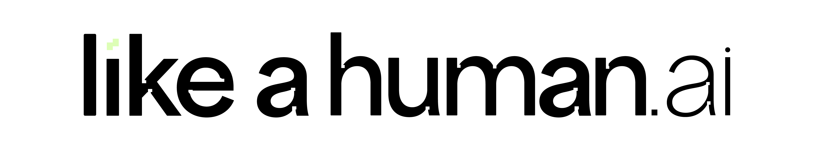

<p align="center">
  
</p>

<h1 align="center">Coding Standards for Claude Code</h1>

<p align="center">
  Interview. Generate. Enforce. For any stack.<br/>
  <a href="https://likeahuman.ai">likeahuman.ai</a>
</p>

---

Your AI writes code without knowing your rules. Every project has different conventions, every team has different opinions, and Claude just guesses.

This plugin fixes that. It interviews you about how you like your code, analyzes your actual codebase, generates personalized standards, and enforces them with a pre-commit hook. No more reviewing AI output for style violations.

## What's inside

| Skill | Command | What it does |
|-------|---------|-------------|
| **Coding Interview** | `/coding-standards:coding-interview` | Analyzes your codebase, interviews you step-by-step, generates personalized standards + pre-commit hook |
| **Coding Standards** | Auto-loaded | Rule files generated for YOUR stack — only the ones that match |
| **Lint** | `/coding-standards:lint` | On-demand code quality audit. Auto-detects stack, applies matching rules |
| **Organize** | `/coding-standards:organize` | Restructures any folder into domain-driven layout with import updates |

## Install

```
/plugin install coding-standards@likeahuman-ai
```

Or manually:

```bash
git clone https://github.com/likeahuman-ai/coding-standards.git
cd coding-standards
./setup.sh
```

## How it works

1. Run `/coding-standards:coding-interview new`
2. It silently analyzes your codebase — detects stack, reads components, backend, config, git history
3. Presents your "Code Style Profile" based on what it found
4. Interviews you topic-by-topic to confirm and deepen
5. Finds gaps and suggests rules for uncovered areas
6. **Asks where to save: project (team) or personal**
7. Generates coding-standards files personalized to your stack
8. Sets up a pre-commit hook that enforces the rules
9. Dry runs the hook on your full codebase and helps you fix violations

The whole process takes one conversation. After that, every commit is checked automatically.

### For teams or for yourself

You choose where the standards live:

| Option | Where | Who gets them | Best for |
|---|---|---|---|
| **Project** | `.claude/rules/` in your repo | Everyone who clones the repo | Teams, open source, shared codebases |
| **Personal** | `~/.claude/skills/` on your machine | Just you, across all projects | Personal preferences |
| **Both** | Project + personal overrides | Team gets shared rules, you get extras | Team lead with personal additions |

**Project-scoped standards** are committed to git. When a teammate clones the repo, Claude Code reads `.claude/rules/*.md` automatically — no setup needed on their end. The pre-commit hook is also committed, so enforcement is team-wide.

## The Interview (7 phases)

| Phase | What happens |
|-------|-------------|
| 1. Silent Analysis | Reads your codebase — detects stack, patterns, inconsistencies |
| 2. Present Findings | Shows your "Code Style Profile" and asks targeted questions |
| 3. Deep Dive | One topic at a time with examples from YOUR code |
| 4. Gap Analysis | Identifies missing standards, backend gaps, security holes |
| 5. Generate Standards | Writes only the rule files matching your detected stack |
| 6. Wire Into Claude | Connects standards to Claude Code, cleans up duplicates |
| 7. Test & Refactor | Dry runs the hook, triages violations, batch refactors |

## 25+ stacks supported

Auto-detects and adapts to whatever you're building with:

| Category | Frameworks & Languages |
|----------|----------------------|
| JS/TS Frontend | React, Next.js, Vue/Nuxt, Angular, Svelte/SvelteKit, Astro, Remix, Gatsby, SolidJS |
| JS/TS Backend | Express, Fastify, NestJS, Hono, Elysia, tRPC, Convex |
| Python | Django, FastAPI, Flask, Celery |
| PHP | Laravel (deep), Symfony, WordPress |
| Ruby | Rails (deep) |
| Go | Chi, Gin, Echo, Fiber + standard layout |
| Rust | Axum, Actix-web, Rocket, Warp |
| Java | Spring Boot (deep) |
| Kotlin | Ktor, Android/Compose |
| C# / .NET | ASP.NET Minimal API + Controllers, EF Core |
| Elixir | Phoenix, LiveView |
| Scala | Play, Akka |
| Deno | Fresh, Oak |
| Mobile | React Native/Expo, Flutter/Dart, SwiftUI, Kotlin/Compose |
| Infrastructure | Terraform, Docker, GitHub Actions, GitLab CI |
| Databases/ORMs | Prisma, Drizzle, TypeORM, Sequelize, Mongoose, Ecto, EF Core, Eloquent |
| Auth | Clerk, Auth.js, Lucia, Passport, Spring Security |
| Styling | Tailwind, CSS Modules, styled-components, Vanilla Extract, SCSS |

## Pre-commit hook

Generated per-project with checks matching your detected stack. Runs on staged files only — fast, zero API cost.

**14 language check blocks:** TypeScript/JS, Python, Go, Rust, Ruby, PHP/Laravel, C#, Elixir, Kotlin, Scala, Dart, Swift + universal

**What it catches:**

| BLOCKING (rejects commit) | WARNING (shows alert) |
|---|---|
| Hardcoded secrets, API keys | File over 200 lines |
| Debug statements left in code | Production print/log statements |
| `eval()` and code injection | Empty catch/except blocks |
| Merge conflict markers | Force unwraps (Swift `!`, Kotlin `!!`) |
| `.env` files staged | Mutable where immutable preferred |
| Raw SQL without parameterization | Missing type hints |

Supports `.coding-standards-ignore` for accepted tech debt.

## What gets generated

Only the files matching your stack. Not all of them — just what you need.

**Next.js + Convex + Tailwind project:**
```
rules/
  reuse-first.md, component-architecture.md, naming-conventions.md,
  file-organization.md, types-and-constants.md, typescript-quality.md,
  react-patterns.md, tailwind-and-tokens.md, state-management.md,
  convex-backend.md, security.md, error-handling.md, general-quality.md
```

**Django + FastAPI project:**
```
rules/
  reuse-first.md, naming-conventions.md, file-organization.md,
  python-quality.md, django-patterns.md, fastapi-patterns.md,
  security.md, error-handling.md, general-quality.md
```

**Go project:**
```
rules/
  reuse-first.md, naming-conventions.md, file-organization.md,
  go-patterns.md, security.md, error-handling.md, general-quality.md
```

## Commands

| Command | When to use |
|---------|-------------|
| `/coding-standards:coding-interview new` | First time — full interview + generation |
| `/coding-standards:coding-interview refresh` | Quarterly — re-analyze codebase for drift |
| `/coding-standards:coding-interview extend` | Add rules for a new area (mobile, testing, CI/CD) |
| `/coding-standards:lint` | Before shipping — deep audit |
| `/coding-standards:lint path/to/file` | Quick check on specific file |
| `/coding-standards:organize path/to/dir` | Restructure a messy directory |

## Philosophy

1. **Reuse first** — extend existing code before creating new
2. **Building bricks** — small, generic, reusable units composed into features
3. **Domain-driven** — organize by what things DO, not what they ARE
4. **Minimum viable complexity** — three similar lines beat a premature abstraction
5. **Code speaks louder** — observe patterns before asking preferences
6. **One source of truth** — one type, one constant, one component per concept

## Update

```
/plugin update coding-standards@likeahuman-ai
```

## Uninstall

```
/plugin uninstall coding-standards@likeahuman-ai
```

## Troubleshooting

| Problem | Solution |
|---|---|
| Skills not recognized | Run `/reload-plugins` |
| `/lint` shows no results | Check source files exist in expected paths |
| Pre-commit blocks everything | Run `./scripts/check-coding-standards.sh` directly to see output |
| Hook permission denied | `chmod +x scripts/check-coding-standards.sh` |
| Standards feel wrong | `/coding-standards:coding-interview refresh` |
| Need rules for new area | `/coding-standards:coding-interview extend` |

## Requirements

- [Claude Code](https://docs.anthropic.com/en/docs/claude-code) v1.0.33+
- git + bash
- Works on macOS and Linux

## License

MIT — see [LICENSE](LICENSE)

---

<p align="center">
  Built by <a href="https://likeahuman.ai">Like a Human</a> — AI development studio
</p>
